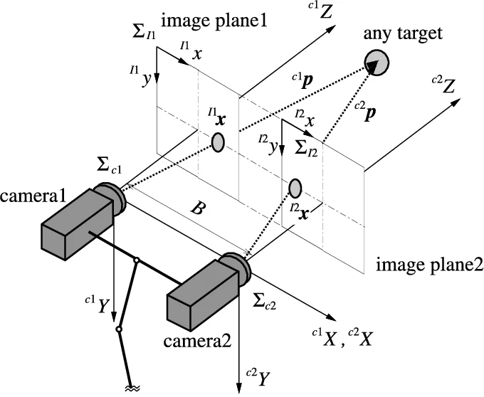

[<<](01_kamera_modell.md) | [^](README.md) | [>>](03_ismert_meret.md)

# Hogyan lehet 2D képből 3D információt kinyerni?

## Sztereo kamera

<p align="center"></p>

*(Forrás: https://www.researchgate.net/publication/237740604_Visual_Tracking_of_Unknown_Moving_Object)*


## Példa: Intel Realsense

<p align="center"></p>

Próbáljuk ki!

1. Csatlakoztassuk a RealSense kamerát a számítógéphez!
2. Indítsuk el a következő launch fájlt:

    ```
    ros2 launch aruco_demo realsense_demo_launch.py
    ```

---------------------------------------------------------------------
[<<](01_kamera_modell.md) | [^](README.md) | [>>](03_ismert_meret.md)
