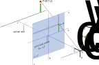

[<<](02_sztereo.md) | [^](README.md) | [>>](04_aruco.md)

# Hogyan lehet 2D képből 3D információt kinyerni?

## Ismert méretű objektum detekciója

---------------------------------------------------------------------
[<<](02_sztereo.md) | [^](README.md) | [>>](04_aruco.md)
